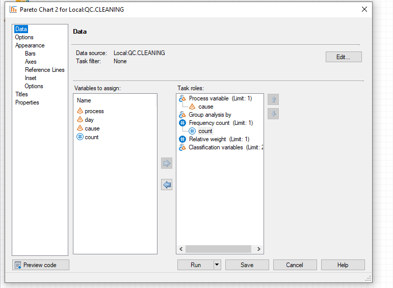
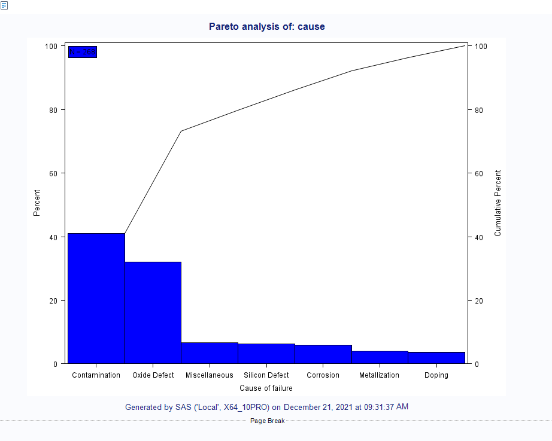
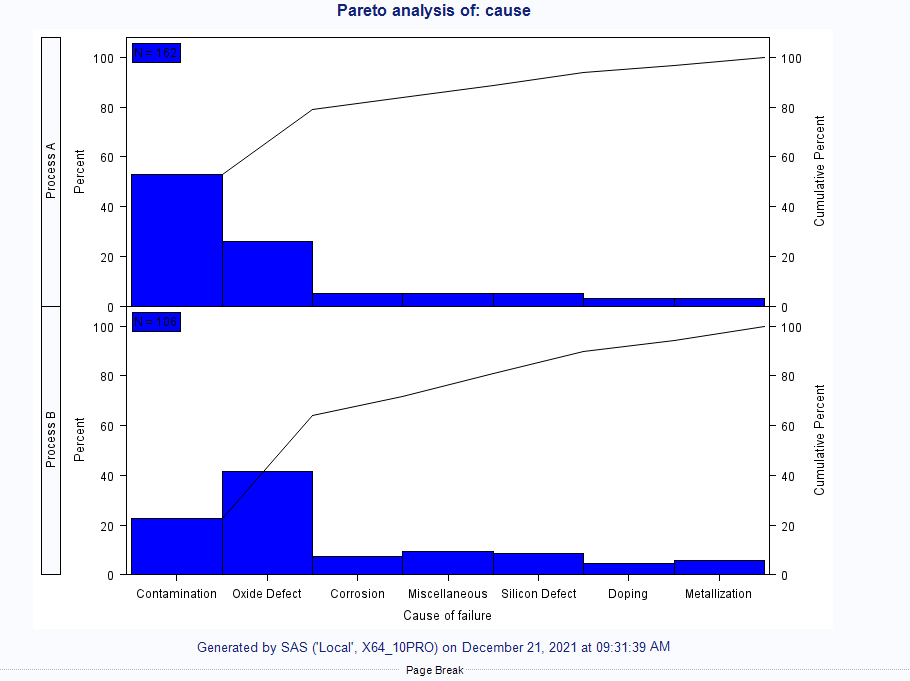
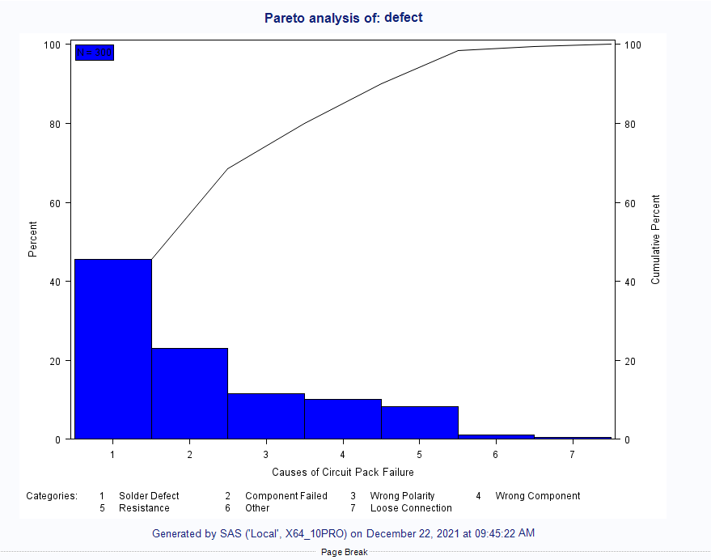

---
title: SAS/QC
layout: template
filename: qc.md
--- 
SAS/QC provides a wide range of specialized tools that help process and manufacturing engineers improve products, optimize products/ processes, and increase levels of customer satisfaction. It includes tools for both process management as well as process control. Some features include quality problem solving with the use of pareto charts, statistical process control (SPC) capabilities, capability analysis, reliability analysis, and so much more. This product supports the entire quality improvement process, and this post will go through a few examples showing some of the key features of using SAS/QC.
Starting off, the first series of charts focuses on identifying root cause of defects over time which is done using Pareto Charts. Pareto’s are not only used to measure frequency of defects that occur in a process, but also the relative weight or impact that is associated if a defect occurs. The first dataset I’ll use (Cleaning) collects data from a manufacturing plant that’s running different processes over multiple days and tracking the defects that occurred throughout the production process. We can use this data to create several different Pareto Chart’s that allow users to better understand the main causes of failure that occurred. 
To generate a Pareto Chart, users have the option to use either SAS code or Enterprise Guides ‘point-and-click’ task to create the chart which is a huge advantage of the software for ease of use and enables all users. 
Below is an example of the Pareto Task built into Enterprise Guide There are several different roles we can define for our variable selections, but we’ll start with defining the process variable as the cause variable which will simply show the highest count of cause or defect that occurred. 
 

We can see in the above pareto that the Contamination is the highest cause of failure by count making up of slightly over 40% of the defects that occurred followed by Oxide Defect. 
This dataset again uses data that was collected from a plant that is running two different processes, Process A and Process B. I can use this to break up the pareto chart even further to see how the results change broken down by Process A and Process B. My data selections remain the same as the first pareto, however this time I am adding one additional parameter, process, from the cleaning dataset into the classification variable role. 
 

By adding in the classification variable, this breaks down the highest causes of failure now shown by each individual process group. We can see that in Process A, Contamination is still the highest cause of failure but in Process B, Oxide Defect is now the highest cause for failure.  
Lastly, for the final pareto I’ll add in the relative weight which shows the impact if a defect were to occur to the process. 
 

Adding the ‘weight’ variable to the relative weight role in the Pareto task, we can see now Solder Defect has the most impact to the process if it was to occur. 

Statistical process control (SPC) is defined as “the use of statistical techniques to control a process or production method”. One of the most common tools for SPC is the control chart that looks at how manufacturing processes change over time and helps determine if the process is running within its normal limits. Variation will always exist in this type of data and the use of control charts will help pick up on those common patterns that exist within the data as well as those outliers when a very high or very low observation occurs and falls outside of its normal threshold. For this next example, I’ll use another dataset (Diameter) that shows a day-by-day breakdown of the measurements from the process coming from different machines. 
With this data, this first SPC chart we’ll use is a Mean and Standard deviation chart. Like the Pareto task, the Mean and Standard Deviation task also allows users to utilize the point and click variable selection process. The data selection itself looks very similar from task to task, but the roles and what we are measuring vary. Starting with the process measurement, this is the variable that we will select to analyze over time which in this case is the diameter variable. Another interesting thing we can do with this chart is select up to two variables that group data into blocks of consecutive subgroups, which in this case will be blocked by both the machine and the operator.  

 

After making our variable selections, on the left side of the window there are several different tabs that we can go through to customize the output of this task. One that I want to focus on is how we go about specifying Control Limits. 
 
There are several different options to compute the control limits. The first method and the one that I have selected to use is to compute the control limits based on the active dataset. In this case, my control limits are calculated based on the data in the diameter dataset. This generates a new output dataset with the newly calculated values. You can also compute control limits based on another dataset or even specify them manually if the values are already known. 
 

After running this task, I’ll have two outputs. One being the control chart pictured above, and the other being a new dataset that stores our calculated control limits based on the active data selection. The task generated two separate control charts for us, one based on the mean of the process measurement and the other based on the standard deviation. With these charts, we can easily see when the process falls outside of its defined control limits indicated by the red markings. For example, in the top chart, we have two instances of where our process when out of spec. Since we also added block variables, we can also see above the chart the machine it occurred on (A455) and the operator was running the machine at that time each instance occurred. 
I can also apply the newly calculated control limits to another dataset. Again, I will be using the Mean and Standard Deviation Chart task, but this time using a new dataset, Diam2, and rather computing the control limits based on the active dataset I will compute using the second option of computing the control limits based on the selected dataset which contains the values of the calculated control limits from our first task. 

 
Applying the previously defined control limits to a new set of data shows that the process is now running within control.  
This post provides a high level overview of some of the functionality built in with SAS/QC, however there are many additional capabilities that are not explored here. SAS/QC delivers a wide range of tools including and beyond what was in this post that help identify and understand variation within processes and support quality improvement efforts across your entire organization. 
To learn more about SAS/QC, check out this fact sheet.

